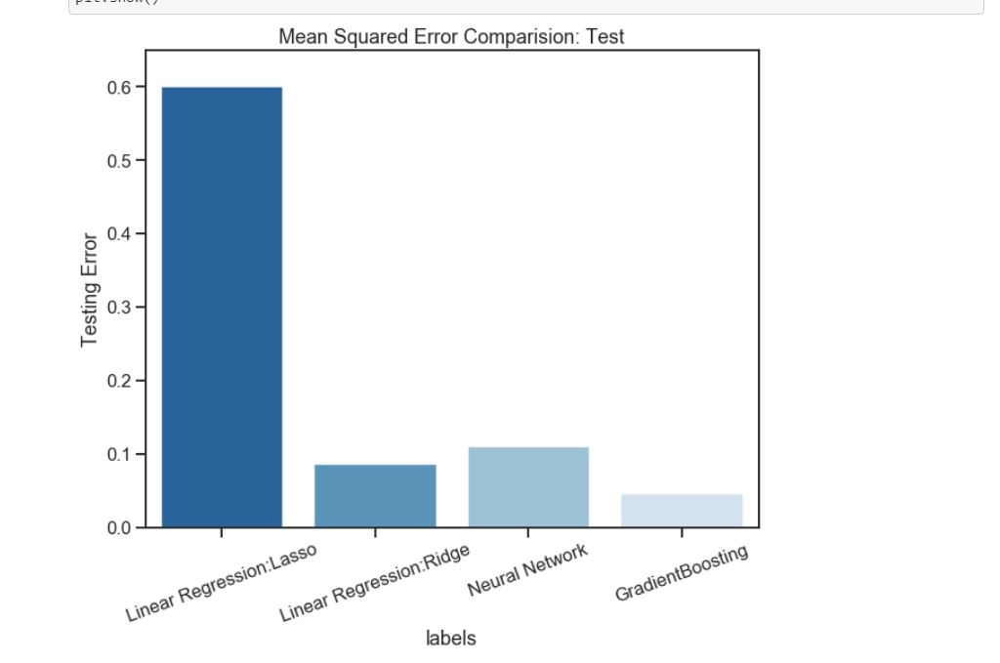

# movie_ratings_prediction
The data is from IMDB-movie ratings and having features release date, title, box-office collection, budget, director, actors etc. The data has missing values, to handle that some of the columns are deleted, some of the rows are also deleted, and applied mean value imputation. 

Applied 3 models to train and predict the movie ratings
* Linear regression (with ridge and lasso)
* Neural Network-Keras
* Gradient Boosting Regressor

The cross-validated GradientBossting Regressor has the minimum mean-squared error. 

