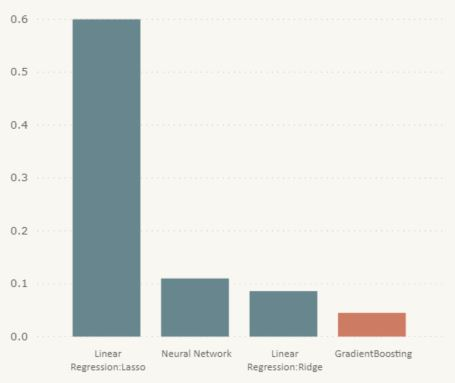

# Predicting Internet Movie Database Ratings
The data is from IMDB-movie ratings and having features release date, title, box-office collection, budget, director, actors etc. 

## Requirements
* Python 3.5+
* Sklearn
* Pandas
* Numpy
* Matplotlib
* Seaborn

The data has missing values, to handle that some of the columns are deleted, some of the rows are also deleted, and applied mean value imputation. 

## Model Implementation

Applied 3 models to train and predict the movie ratings
* Linear regression (with ridge and lasso)
* Neural Network-Keras
* Gradient Boosting Regressor

## Results

The cross-validated GradientBossting Regressor has the minimum mean-squared error. 

